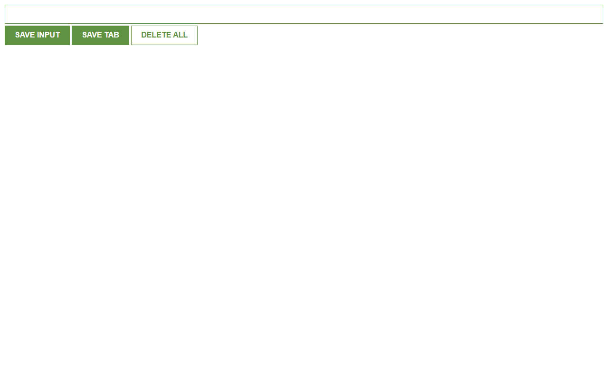

# MyLeads Chrome Extension - README



This repository contains a Chrome Extension called "MyLeads," which allows users to save and manage a list of website URLs for quick access. The extension uses basic JavaScript, HTML, and CSS to create a simple user interface that facilitates saving, viewing, and deleting the stored URLs.

## Table of Contents

- [Introduction](#introduction)
- [Features](#features)
- [Installation](#installation)
- [Usage](#usage)
- [Technologies Used](#technologies-used)
- [Contributing](#contributing)
- [License](#license)

## Introduction

The MyLeads Chrome Extension is designed to help users save and organize website URLs they want to revisit later. With just a few clicks, users can add URLs to their list and access them conveniently through the extension.

## Features

- Save website URLs for future reference.
- View the list of saved URLs with direct links.
- Delete all saved URLs with a double-click.
- Save the current active tab's URL with a single click using the "Tab Save" button.

## Installation

To use the MyLeads Chrome Extension, follow these steps:

1. Download the source code from this repository or clone the repository to your local machine using the following command:

```
git clone <repository_url>
```

2. Open Google Chrome and go to the Extensions page by typing `chrome://extensions` in the address bar and hitting Enter.

3. Enable the "Developer mode" option in the top right corner of the Extensions page.

4. Click on the "Load unpacked" button and select the folder containing the extension's source code that you downloaded or cloned in Step 1.

5. The MyLeads Chrome Extension should now be installed and ready to use.

## Usage

Once the extension is installed, you can access it by clicking on its icon in the Chrome toolbar. The extension interface will appear, containing the following elements:

- **URL Input Field**: Enter the URL of the website you want to save and press the "Save" button. The URL will be added to your list of leads.

- **"Save" Button**: This button allows you to save the URL entered in the input field. Clicking it will add the URL to your list.

- **"Tab Save" Button**: Clicking this button will save the URL of the currently active tab. It automatically captures the URL without the need to enter it manually.

- **Saved URLs List**: The extension displays a list of saved URLs with direct links. You can click on any URL to open it in a new tab.

- **"Delete All" Button**: Double-clicking this button will clear all saved URLs from the list. Be cautious as this action is irreversible.

## Technologies Used

The MyLeads Chrome Extension is built using the following technologies:

- HTML5
- CSS3
- JavaScript
- Chrome Extension API

## Contributing

Contributions to this project are welcome! If you find any issues or want to enhance the extension, feel free to create a pull request. Before contributing, please review the [Contribution Guidelines](CONTRIBUTING.md).

## License

This project is open-source and available under the [MIT License](LICENSE).

---

Thank you for using the MyLeads Chrome Extension! If you have any questions or feedback, please feel free to create an issue or contact the project maintainers. Happy bookmarking!
